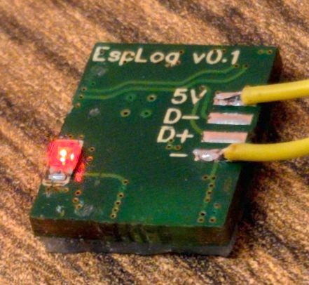
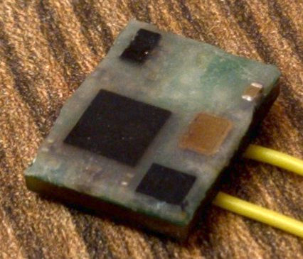
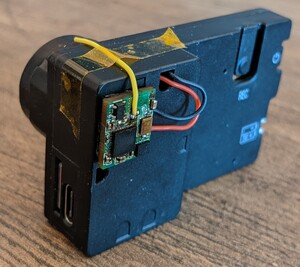

### What is this?
This is a GyroFlow-compatible data logger firmware for the esp32 and esp32-c3 microcontrollers (and probably others supported by esp-idf).

### Supported IMUs
The following IMUs can be used over the i2c bus:
* BMI160
* MPU-6050 / MPU-6000
* LSM6DSR (not recommended)

### Screenshots

</img>

</img>

### How to build the logger
#### Option 1 - from modules
This is all you need (except wires), this should coust about $5:
* [ESP32-C3-01M (4M)](https://aliexpress.ru/item/1005003092302540.html)
* [BMI160](https://aliexpress.ru/item/4000052683444.html)
* [AMS1117 3.3v LDO](https://aliexpress.ru/item/32659371619.html)
* [USB-C breakout board](https://aliexpress.ru/item/1005002795893679.html)

#### Option 2 - Custom PCB

Four-layer 11 x 14 mm PCB with esp32-c3, 3.3v ldo and either bmi160 or lsm6dsr gyro.
The side with the components can be submerged in epoxy, making the logger almost a perfect 11x14x2.5mm cube, so it is easier to glue to a camera.

[EasyEDA project](https://oshwlab.com/vladimir.pinchuk01/gyro-logger-esp32c3_copy)

</img>
</img>

Although the previous version of this PCB has been manufacted and assembled by hand, found bugs were fixed in this version, no guarantees that this version is bug-free.

</img>
</img>
### Hardware prototypes
#### EspLog

#### Simple esp32c3 logger

#### Esp32 logger
