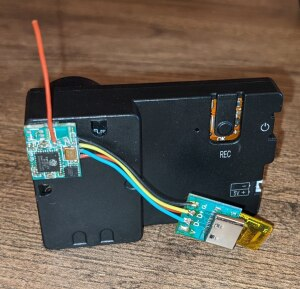
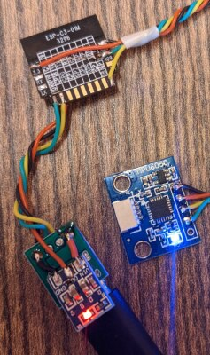

### What is this?
This is a GyroFlow-compatible data logger firmware for the esp32 and esp32-c3 microcontrollers (and probably others supported by esp-idf).

### Warning
This is in alpha-stage

### Supported IMUs
The following IMUs can be used over the i2c bus:
* MPU-6050 / MPU-6000
* LSM6DSR

### How to build
#### Option 1 - from modules
This is all you need (except wires), this should coust about $5:
* [ESP32-C3-01M (4M)](https://aliexpress.ru/item/1005003092302540.html)
* [MPU6050](https://aliexpress.ru/item/32340949017.html)
* [AMS1117 3.3v LDO](https://aliexpress.ru/item/32659371619.html)
* [USB-C breakout board](https://aliexpress.ru/item/1005002795893679.html)

#### Option 2 - JLCPCB PCBA order
Although the previous version of this PCB has been manufacted and assembled by hand, found bugs were fixed in this version, no guarantees that this version is bug-free.

[EasyEDA project](https://oshwlab.com/vladimir.pinchuk01/gyro-logger-esp32c3_copy)

### Hardware prototypes
#### EspLog

Note: the final version won't need an external 3.3v LDO

#### Simple esp32c3 logger

#### Esp32 logger
