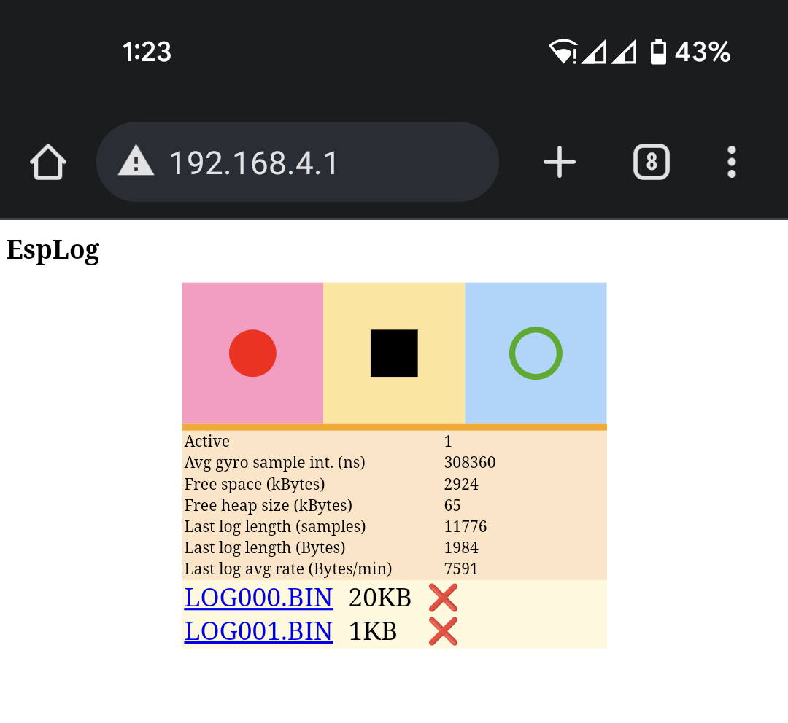
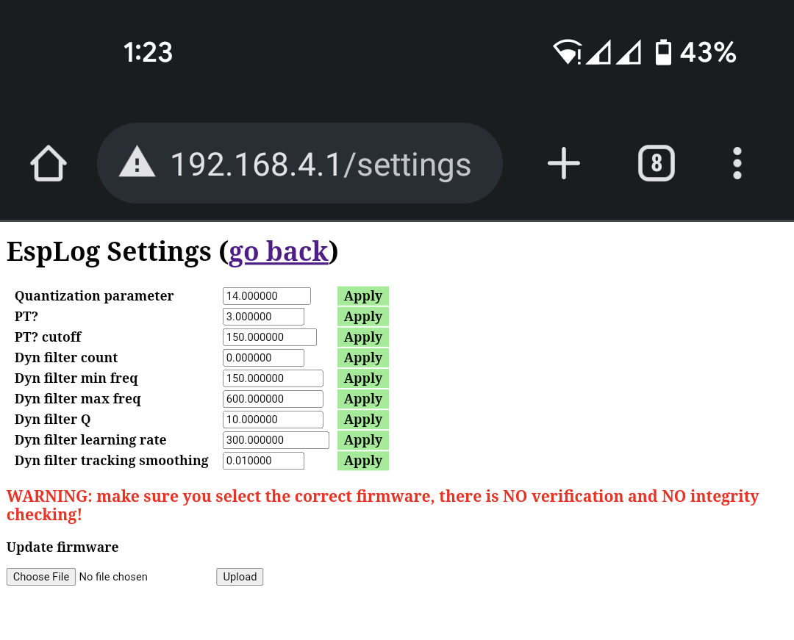
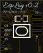
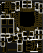
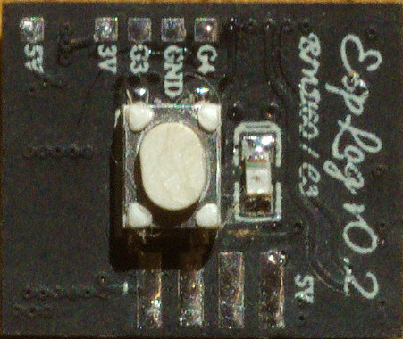
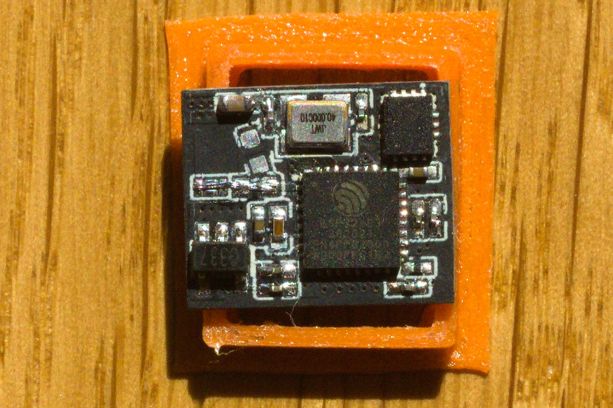

### What is this?
This is a GyroFlow-compatible data logger firmware for the esp32 and esp32-c3 microcontrollers (and probably others supported by esp-idf)

### Required hardware
* An esp32 or esp32-c3 with 4MB flash
* A BMI160 or MPU6050 IMU
* 4 wires

You can get these as separate modules or on a single board (EspLog)

### How to flash and get started?
1. Connect your IMU board to the ESP board. For esp32 it is recommended to connect SDA and SCL to pins 16 and 17 accordingly. For esp32-c3 - to pins 6 and 7.
1. Download the firmware from github. You can find the latest build in "Artifacts" of the latest build from the "Actions" tab.
The zip file will contain a readme file with a command line for flashing using [esptool](https://github.com/espressif/esptool/releases/tag/v4.1).
2. After flashing the firmware you should see a wifi network with SSID starting with "esplog_". Connect to that network with "12345678" password.
3. Go to [http://192.168.4.1/settings](http://192.168.4.1/settings), enter the SDA and SCL pin numbers you have connected the IMU to, click "Apply".
4. Reboot the board and go to [http://192.168.4.1](http://192.168.4.1). If the IMU is OK, "Avg gyro sample int. (ns)" should be non-zero.
5. Calibrate the accelerometer. For that you need to go to [http://192.168.4.1/calibration](http://192.168.4.1/calibration), add some calibration points (for example x-up, x-down, y-up, y-down, z-up, z-down). Hold your IMU stationary for some time before adding a points as the accelerometer data is low-pass filtered. Then click "Calculate offsets" and then "Save to flash".
5. You can connect a button and a led to any free pins and assign the pin numbers in settings. NOTE: when recording is started using the button, wifi is disabled until you stop the recording using the button. This is done intentionally.

### Screenshots

</img>

</img>

#### EspLog PCB

Four-layer 11 x 14 mm PCB with esp32-c3, 3.3v ldo and either bmi160 or lsm6dsr gyro.
The side with the components can be submerged in epoxy, making the logger almost a perfect 11x14x2.5mm cube, so it is easier to glue to a camera.

[EasyEDA project](https://oshwlab.com/vladimir.pinchuk01/gyro-logger-esp32c3_copy)

</img>
</img>

Assembled:

</img>
</img>
